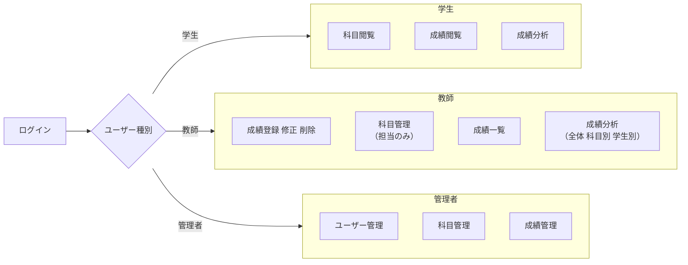
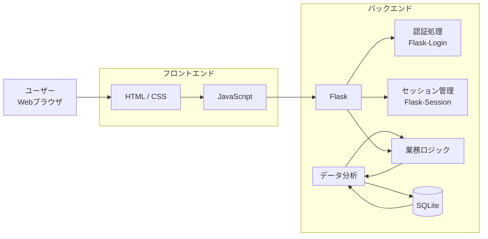

# アプリ名 
**学生管理システム**

# 役割担当
| 役割 | 担当 |
| --- | --- |
| ログイン機能 | [@taku3](https://github.com/taku3mi) |
| 成績に関する機能 | [@Alicia4771](https://github.com/Alicia4771) |
| 科目に関する機能 | [@ta-nu-13](https://github.com/ta-nu-13) |
| ユーザーに関する機能 | [@kosuke361](https://github.com/kosuke361) |
| その他 | [@conFess233](https://github.com/conFess233) |

# 概要
学生管理システムは、学生の成績管理および成績分析を主目的としたWebアプリケーションである。
<br>ログイン機能を基盤とし、成績情報・科目情報・ユーザー情報の管理を行う。
<br>また、成績データを全体または個人単位で分析・可視化することにより、どの科目が得意または苦手であるか、成績が高い科目・低い科目は何かを把握できる。
<br>これにより、学生一人ひとりの長所や短所を明確にし、効率的な学習計画の立案を支援するとともに、
自身の成長を客観的に確認することが可能となる。
<br>さらに、これまでの管理システムと違い、過去の成績分析結果を基に将来の成績を予測し、学生の成績向上を支援するのことができる。

# 機能概要

- [ログイン機能](#-ログイン機能)
>ログイン機能は、ユーザーIDとパスワードよりアカウントを認証し、ログイン状態を保持し、認証が必要な機能にアクセスするためのものである。
- [ユーザー管理機能](#-ユーザー管理機能)
>ユーザー管理機能は、システム内のユーザー（学生、教師、管理者）の情報や権限を管理するためのものである。
- [科目管理機能](#-科目管理機能)
>科目管理機能は、システム内の科目（専攻、学年、曜日、時間帯）の情報を管理するためのものである。
- [成績管理・分析機能](#-成績管理分析機能)
>成績管理・分析機能は、学生の成績情報を管理し、全体または個人、科目別に成績を分析して可視化し、それを基づいて未来の成績予測を行うためのものである。
- [ユーザー権限](#ユーザー権限)
>ユーザー権限は、システム内のユーザー（学生、教師、管理者）が持つ操作権限を表すものである。<br>
>各ユーザー種別に応じて、特定の機能にアクセスできるよう制御される。

## 🔐 ログイン機能
- ユーザーID・パスワードによるログイン
- ユーザー種別（学生 / 教師 / スーパーユーザーを選択してログイン）
- ログイン成功・失敗時の画面制御
- ログアウト処理
- セッション管理（ログイン状態の保持）
- 不正入力時のエラーメッセージ表示


## 👤 ユーザー管理機能
- ユーザー情報の登録 / 修正 / 削除
- ユーザー一覧表示
- 名前・IDによる検索
- ユーザー権限（学生 / 教師）の管理
- 権限に応じた閲覧・操作制御
- GPA・科目別評価のグラフ表示


## 📘 科目管理機能
- 科目情報の登録 / 修正 / 削除
- 科目一覧の表示
- 専攻・学年・曜日による検索
- 学生の選科一覧表示
- 科目と担当教師の管理


## 📊 成績管理・分析機能
- 成績情報の登録 / 修正 / 削除（教師）
- 学籍番号・科目名による成績検索
- 学生ごとの成績一覧表示
- 平均点・最高点・最低点の算出
- 全体成績の統計処理
- 得意科目・苦手科目の分析
- 未来の成績予測
- グラフ・表形式での成績可視化

## ユーザー権限

### 学生
- 科目/教師の閲覧
- 履修登録
- 自分の成績情報の閲覧
- 成績分析

### 教師
- 学生の成績情報の登録・修正・削除
- 学生が登録した科目から履修取り消し
- 科目管理
- 成績分析（全体/科目別/学生別）

### スーパーユーザー
- 全ユーザー情報の管理
- 全成績情報の管理
- 全科目情報の管理

# アプリケーション構成

### システム構成


## 使用技術
- Python 3.13.7
- Flask
- SQLite + peewee
- HTML / CSS / JavaScript

## 動作条件
```bash
python 3.13.7

Flask==3.1.2
Flask-Login==0.6.3
peewee==3.18.3
```

## 使い方
1. リポジトリをクローン。
```bash
git clone https://github.com/OOP2-2025-final-G03/StudentManagementSystem.git
cd StudentManagementSystem
```
2. 必要なライブラリをインストール。
```bash
pip install -r requirement.txt
```

3. アプリケーションを起動。
```bash
python main.py
```

4. ブラウザでアプリケーションにアクセス。
```
http://localhost:8000/
```
