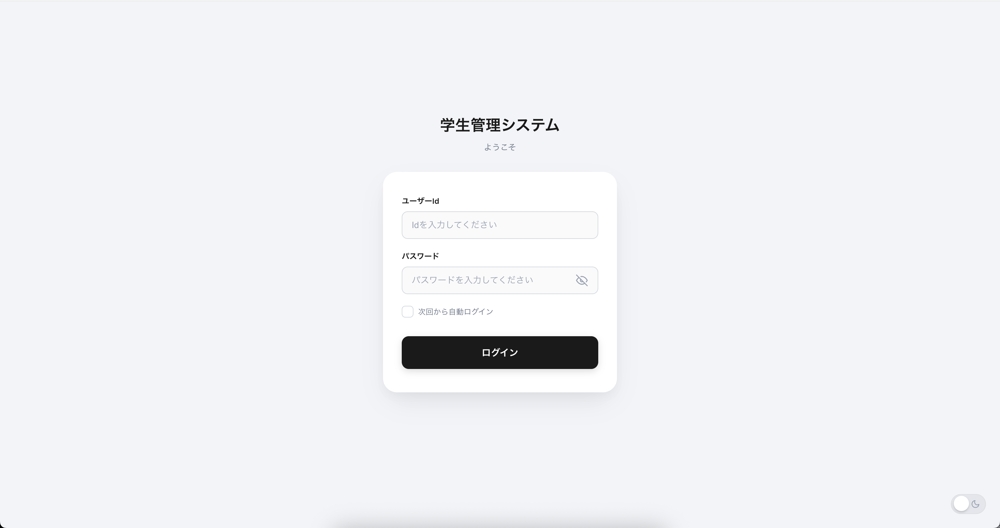
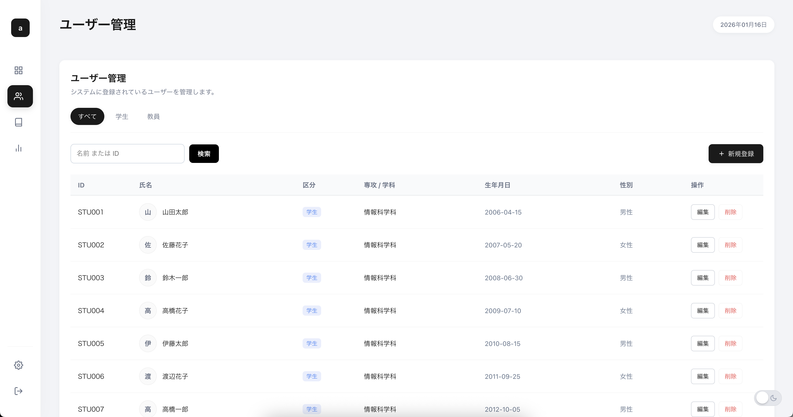
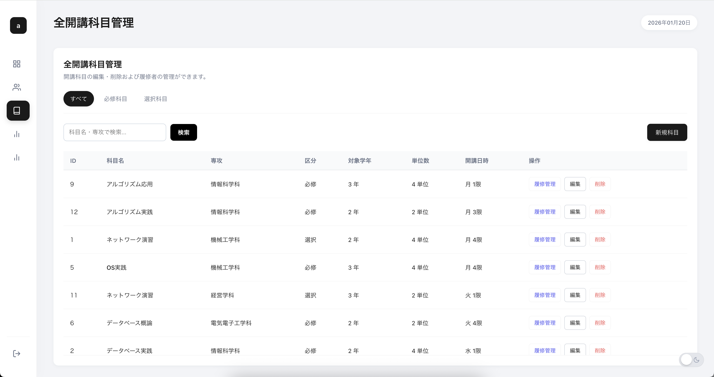
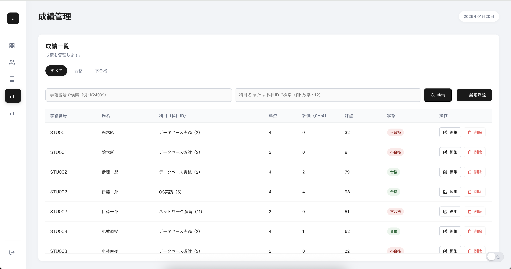
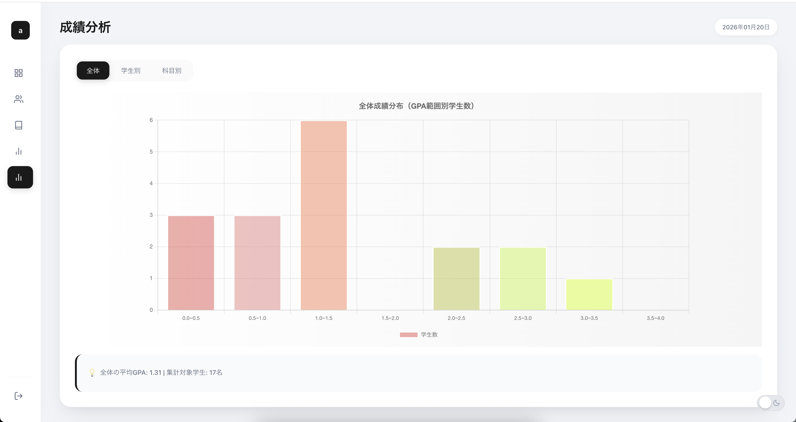
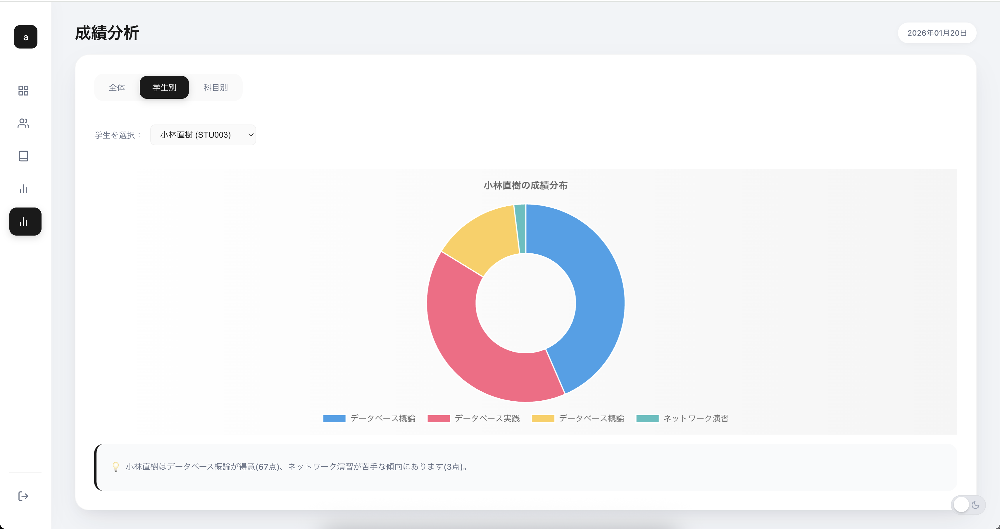
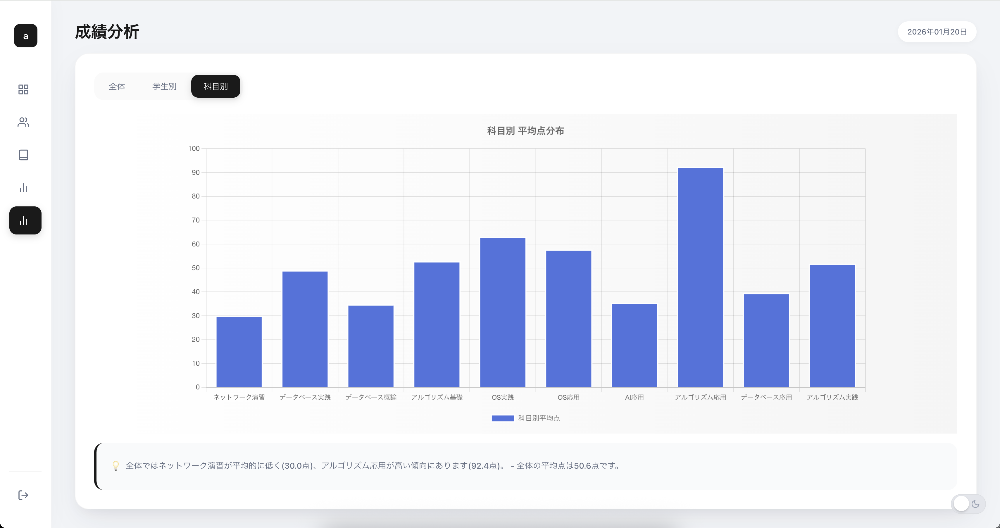
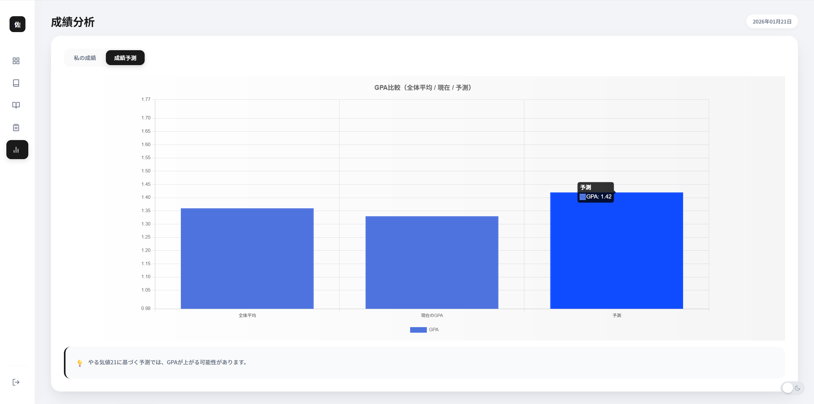
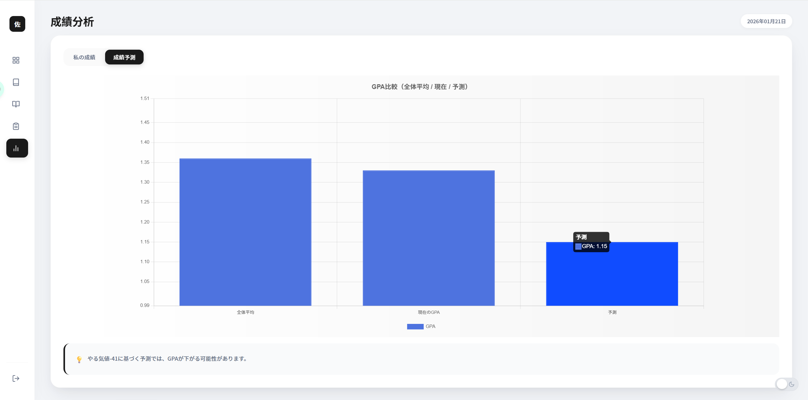
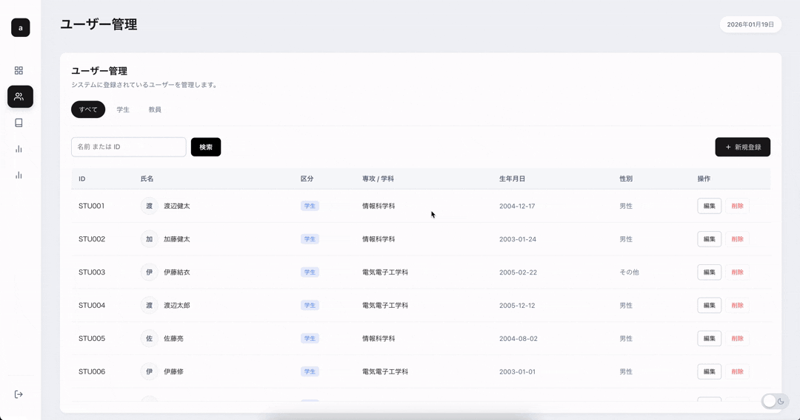

## 学生管理システム

## 概要
学生管理システムは、学生の成績管理と分析を主目的とした、使いやすいWebアプリケーションである。

ログイン機能を軸に、成績情報・科目情報・ユーザー情報をしっかり管理できる。

成績データは全体または個人ごとに分析・可視化できるので、どの科目が得意でどの科目が苦手か、点数の高い科目・低い科目が一目で分かる。

その結果、学生一人ひとりの長所や課題が明確になり、効率的な学習計画の立案を手助けするとともに、自分の成長を客観的に確認することができる。

さらに、従来の管理システムとは異なり、過去の成績データをもとに将来の成績を予測する機能も備えており、学習の改善や成績向上をより積極的に支援する。

## アピールポイント
- 単にデータの管理だけではなく、成績分析機能より**可視化**することで、数字だけより分かりやすく、**成績の傾向を一目で把握**できる。
- 成績管理と成績分析の機能を組み合わせ、分析結果に基づいて学生個人や科目ごとの長所・短所を判断することで、教師は学生や各科目の**学習状況を迅速に把握する**ことができる。また、学生自身も自分の得意分野や苦手分野を理解し、それに応じた**学習計画を立てる**ことが可能となる。
- さらに、分析した成績データをもとに学生の**次回の成績を簡易的に予測する**ことで、適度な緊張感を与え、**学習に対する姿勢や意識の改善を促す**。

## 機能概要

- ログイン
>ユーザーIDとパスワードよりアカウントを認証し、ログイン状態を保持し、認証が必要な機能にアクセスするためのものである。



- ユーザー管理
>システム内のユーザー（学生、教師）の情報や権限を管理するためのものである。
><br>管理者(admin)よりユーザーを追加、削除、権限を管理することができる(管理者アカウントはデータベースを初期化する時に自動的に作成される)。
><br>管理者アカウントのユーザーIDは"admin"、パスワードは"admin"である。



- 科目管理
>システム内の科目（専攻、学年、曜日、時間帯）の情報を管理するためのものである。
><br>教師より科目を追加、削除、編集、履修管理することができる。



- 成績管理
>学生の成績を登録、管理、分析するためのものである。
><br>教師より成績を登録、削除、編集することができる。



- 成績分析
>学生の成績を分析し、全体または個人、科目別に成績を可視化し、それを基づいて未来の成績予測を行うためのものである。

>- 全体
><br>学生全体のGPAを算出し、その分布をヒストグラムで可視化する。



>- 学生別
><br>学生ごとの成績を分析し、その学生が履修した各科目の評点の最高点と最低点によって得意/苦手科目を判断し、メッセージを表示する。



>- 科目別
><br>科目ごとの平均評点を分析し、その平均評点が高い科目と低い科目を判断し、メッセージを表示する。



>- 次回成績予測
><br>簡単に学生全体の平均点、学生のやる気と今回の成績を基に、次回の成績を予測する。





- テーマの切り替え
>ライトモードとダークモードを切り替えることができる。



- ユーザー権限管理
>システム内のユーザー（学生、教師、管理者）が持つ操作権限を表すものである。<br>
>各ユーザー種別に応じて、特定の機能にアクセスできるよう制御される。


## 使用技術
- Python 3.13.7
- Flask
- SQLite + peewee
- HTML / CSS / JavaScript

## 動作条件
```bash
python 3.13.7

# 必要なライブラリ
Flask>=3.1.2
Flask-Login>=0.6.3
peewee>=3.18.3
Jinja2>=3.1.6
Werkzeug>=3.1.5
```

## 使い方
1. リポジトリをクローン。
```bash
git clone https://github.com/OOP2-2025-final-G03/StudentManagementSystem.git
cd StudentManagementSystem
```
>（必要あれば）仮想環境の作成
>```bash
>python -m venv venv
>source venv/bin/activate  # Linux/Mac
>venv\Scripts\activate  # Windows
>```
>仮想環境を終了したい場合
>```bash
> 
>deactivate
>```
2. 必要なライブラリをインストール。
```bash
pip install -r requirement.txt
```

>（必要あれば）テスト用のデータベースを初期化する。
><br>データベースなしの場合はアプリを起動する時自動的に空のデータベースが作成される。
>```bash
>python init_db.py
>```
>引数を指定してデータベースを初期化することもできる。
>```bash
>python init_db.py --s 学生数 --t 教員数 --sb 科目数
>```
>例：
>```bash
>python init_db.py --s 20 --t 5 --sb 12
>```

3. アプリケーションを起動。
```bash
python main.py
```

4. ブラウザでアプリケーションにアクセス。
```
http://localhost:8000/
```

>ポート番号とホストを変更したい場合
>```bash
>python main.py --port ポート番号 --host ホスト
>```
>例：
>```bash
>python main.py --port 8080 --host 0.0.0.0
>```
>utils/config.pyでポート番号とホストを変更することもできる。
>```python
>HOST = os.getenv("HOST", "0.0.0.0") # ホスト名
>PORT = int(os.getenv("PORT", "8000")) # ポート番号
>```

## 役割担当
| 役割 | 担当 |
| --- | --- |
| ログイン機能 | [@taku3](https://github.com/taku3mi) |
| 成績に関する機能 | [@Alicia4771](https://github.com/Alicia4771) |
| 科目に関する機能 | [@ta-nu-13](https://github.com/ta-nu-13) |
| ユーザーに関する機能 | [@kosuke361](https://github.com/kosuke361) |
| 設計、結合、テスト、debug | [@conFess233](https://github.com/conFess233) |

## [問い合わせ先](https://github.com/OOP2-2025-final-G03/StudentManagementSystem/issues/new)
- このプロジェクトに関する質問やバグ報告は、上記のリンクからGitHubのIssue機能またはリーダー([@conFess233](https://github.com/conFess233))に連絡してください。

