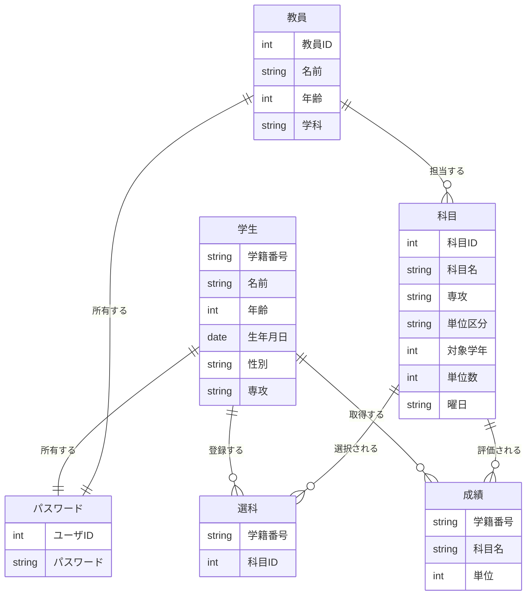

# 最終課題
## 学生管理システム

### チームメンバー

- k24019 [@taku3](https://github.com/taku3mi)
- k24039 [@Alicia4771](https://github.com/Alicia4771)
- k24056 [@ta-nu-13](https://github.com/ta-nu-13)
- k24100 [@kousuke361](https://github.com/kousuke361)
- k24103 [@conFess233](https://github.com/conFess233)

### 使用するもの
- Flask
- SQLite

### データベース
- 学生情報（学籍番号、名前、年齢、生年月日、性別、専攻）
- 教員情報（教員ID、名前、年齢、学科）
- 選科情報（学生のID、登録した科目）
- パスワード情報（ユーザID、パスワード）
- 成績情報（学籍番号、科目名、単位）
- 科目情報（科目ID、科目名、担当教師、専攻、単位区分、対象学年、単位数、曜日）
### ER図



### 機能要件
- ログイン機能（学生、教師共通）
- ユーザー情報の登録、修正、削除、検索
- 成績情報の登録、修正、削除、検索
- 科目情報の登録、修正、削除、検索
- 成績情報の集計（平均点、最高点、最低点）
- 成績情報の可視化（グラフや表形式での表示）
- 未来の成績の予測機能
- 全体/学生ごとの成績分析(得意、苦手など)

#### ユーザー権限
- 学生
    - 科目/ユーザーの一覧を見ることができる
    - 自分の成績を見ることができる
- 教師
    - 学生の成績を編集することができる。
    - 学生が登録した科目から削除できる


### 役割分担
| 役割 | 担当 |
| --- | --- |
| ログイン機能 | [@taku3](https://github.com/taku3mi) |
| 成績情報および成績に関する機能 | [@Alicia4771](https://github.com/Alicia4771) |
| 科目情報および科目に関する機能 | [@ta-nu-13](https://github.com/ta-nu-13) |
| ユーザー情報およびユーザーに関する機能 | [@kousuke361](https://github.com/kousuke361) |


### ディレクトリの構造
```
StuMnagerSys/
- main.py
- database.db
- /static
    - /css
        - .cssファイル
    - /js
        - .jsファイル
- /templates
    - .htmlファイル(各ページのHTMLファイル)
- /models
    - .pyファイル(データベースモデルの定義)
- /routes
    - .pyファイル(ルーティングの定義)
...
```

