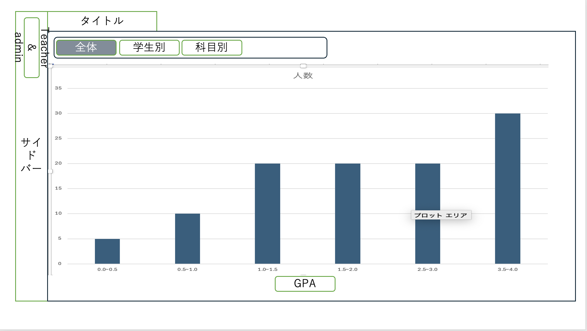
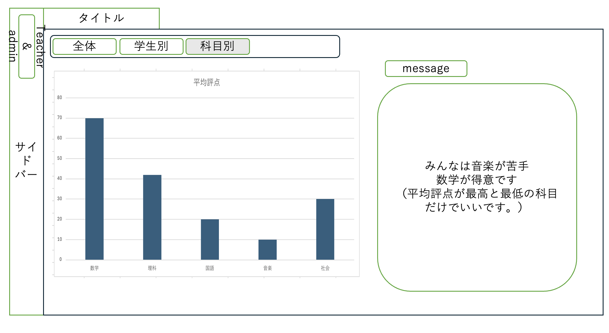
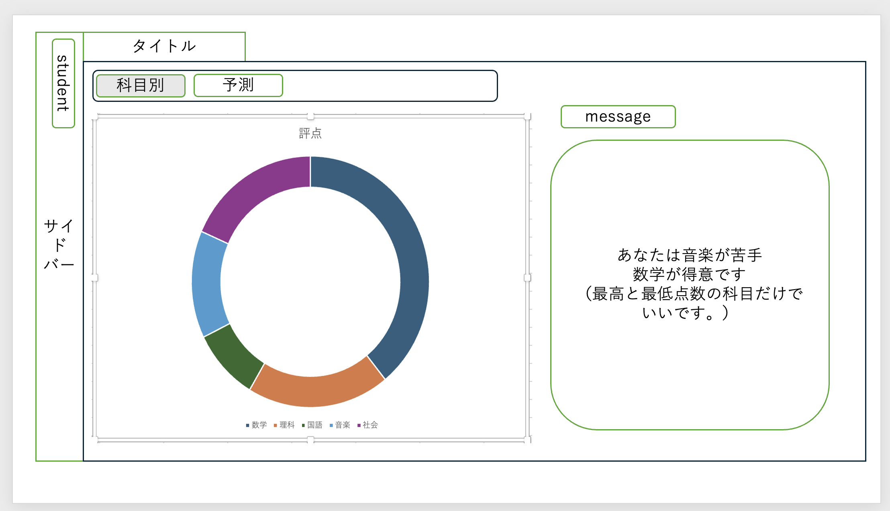
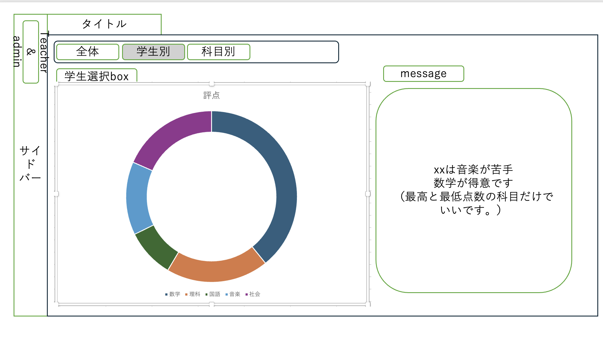
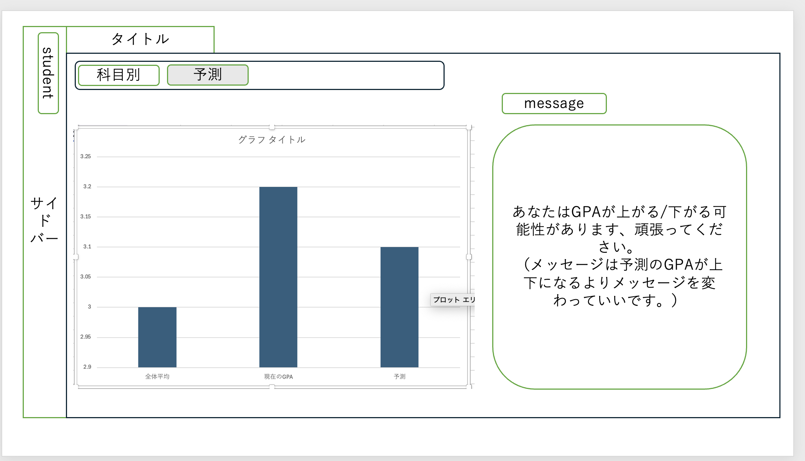

# 最終課題
## 学生管理システム

### チームメンバー

- k24019 [@taku3](https://github.com/taku3mi)
- k24039 [@Alicia4771](https://github.com/Alicia4771)
- k24056 [@ta-nu-13](https://github.com/ta-nu-13)
- k24100 [@kosuke361](https://github.com/kosuke361)
- k24103 [@conFess233](https://github.com/conFess233)

### 使用するライブラリ
- Flask
- Flask-login
- SQLite
- peewee

### データベース
- [ユーザー情報](./models/user.py)（ユーザID、ロール、最終ログイン日時、最終ログインIPアドレス）
- [学生情報](./models/student.py)（学籍番号、名前、生年月日、性別、専攻）
- [教員情報](./models/teacher.py)（教員ID、名前、年齢、学科）
- [選科情報](./models/enrollment.py)（学生のID、登録した科目）
- [パスワード情報](./models/password.py)（ユーザID、パスワード）
- [成績情報](./models/grade.py)（学籍番号、科目ID、単位、評価）
- [科目情報](./models/subject.py)（科目ID、科目名、専攻、単位区分、対象学年、単位数、曜日）
- [やる気情報](./models/motivation.py)（学籍番号、やる気値）

### 機能要件
- ログイン機能（学生、教師共通）
- ユーザー情報の登録、修正、削除、検索
- 成績情報の登録、修正、削除、検索
- 科目情報の登録、修正、削除、検索
- 成績情報の集計（平均点、最高点、最低点）
- 成績情報の可視化（グラフや表形式での表示）
- 未来の成績の予測機能
- 全体/学生ごとの成績分析(得意、苦手など)

#### ユーザー権限
- 学生
    - 科目/ユーザーの一覧を見ることができる
    - 自分の成績を見ることができる
- 教師
    - 学生の成績を編集することができる。
    - 学生が登録した科目から削除できる
- スーパーユーザー
    - 全てのユーザー情報を管理することができる。
    - 全ての成績情報を管理することができる。
    - 全ての科目情報を管理することができる。


### 役割分担
| 役割 | 担当 |
| --- | --- |
| ログイン機能 | [@taku3](https://github.com/taku3mi) |
| 成績情報および成績に関する機能 | [@Alicia4771](https://github.com/Alicia4771) |
| 科目情報および科目に関する機能 | [@ta-nu-13](https://github.com/ta-nu-13) |
| ユーザー情報およびユーザーに関する機能 | [@kosuke361](https://github.com/kosuke361) |

| 役割 | 内容                                                                                                                                   |
| --- | --- |
| ログイン機能 | ユーザーIDとパスワードによるログイン処理<br>ユーザー種別（学生／教師）の判定<br>ログイン成功・失敗時の画面制御<br>ログアウト処理<br>セッション管理（ログイン状態の保持）<br>不正入力時のエラーメッセージ表示|
| 成績情報および成績に関する機能 | 成績情報の登録（教師）<br>成績情報の修正（教師）<br>成績情報の削除（教師）<br>学籍番号・科目名による成績検索<br>学生ごとの成績一覧表示<br>成績の平均点・最高点・最低点の算出<br>全体成績の統計処理<br>得意科目・苦手科目の分析<br>未来の成績予測処理<br>データベースからグラフ表示用のデータの集計（学籍番号、科目ID、単位x評価(int)）|
| 科目情報および科目に関する機能 | 科目情報の登録<br>科目情報の修正<br>科目情報の削除<br>科目一覧の表示<br>専攻・学年・曜日による科目検索<br>学生の選科（科目登録）処理<br>学生が登録した科目の削除（教師権限）<br>科目と担当教師の管理 |
| ユーザー情報およびユーザーに関する機能 | 学生情報の登録・修正・削除（スーパーユーザー）<br>教員情報の登録・修正・削除（スーパーユーザー）<br>ユーザー一覧の表示<br>名前・IDによるユーザー検索<br>ユーザー権限（学生／教師）の管理<br>学生は自分の情報のみ閲覧可能とする制御<br>教師は全ユーザー情報を管理可能とする制御<br>グラフ表示（科目ごとの評価、GPA）|


### ディレクトリの構成
```
StudentManagementSystem/
- main.py
- database.db
├── static/
│   ├── css/
│   │   ├── base.css            # 全画面共通スタイル
│   │   ├── login.css           # ログイン画面用スタイル
│   │   ├── content.css         # メイン画面用スタイル
│   │   ├── list.css            # 一覧画面用
│   │   ├── form.css            # 登録・編集画面用
│   │   └── analytic.css        # 成績分析画面用
│   │
│   └── js/
│       ├── user.js          # ユーザー管理処理
│       ├── user_list.js     # ユーザー一覧処理
│       ├── theme-toggle.js  # テーマ切り替え処理
│       ├── grade.js         # 成績登録・更新
│       └── analytic.js      # グラフ描画（Chart.js）
│ 
├── templates/
│   ├── base.html             # 共通レイアウト（ヘッダー・ナビ）
│   ├── login.html            # ログイン画面
│   ├── content_base.html     # 共通コンテンツレイアウト（メインコンテンツ領域）
│   │
│   ├── user/
│   │   ├── user_list.html    # ユーザー一覧
│   │   ├── user_rows.html    # ユーザー一覧の行
│   │   └── user_form.html    # 登録・編集画面
│   │
│   ├── subject/
│   │   ├── subject_list.html # 科目一覧
│   │   ├── subject_rows.html # 科目一覧の行
│   │   └── subject_form.html # 科目登録・編集
│   │
│   ├── enrollment/
│   │   ├── enrollment_manage.html # 選科管理画面
│   │   ├── enrollment_manage_rows.html # 選科管理画面（行）
│   │   └── enrollment_list.html # 選科一覧
│   │   ├── enrollment_rows.html # 選科一覧の行
│   │
│   ├── grade/
│   │   ├── grade_list.html   # 成績一覧
│   │   ├── grade_rows.html   # 成績一覧の行
│   │   └── grade_form.html   # 成績登録・編集
│   │
│   └── analytic/
│       └── analytic.html      # 成績統計画面
│
├── models/
│   ├── __init__.py
│   ├── user.py               # ユーザーモデル
│   ├── password.py           # パスワード情報モデル
│   ├── subject.py            # 科目モデル
│   ├── student.py            # 学生モデル
│   ├── teacher.py            # 教師モデル
│   ├── enrollment.py         # 選科モデル
│   ├── motivation.py         # やる気モデル
│   └── grade.py              # 成績モデル
│
├── routes/
│   ├── __init__.py
│   ├── auth.py              # 認証（ログイン・ログアウト）
│   ├── user.py              # ユーザー管理
│   ├── subject.py           # 科目管理
│   ├── enrollment.py        # 選科管理
│   ├── grades.py             # 成績管理
│   └── analytics.py          # 成績分析・統計
│
├── utils/
│   ├── auth.py               # 認証・権限判定処理
│   ├── db.py                 # データベース接続管理
│   ├── decorator.py          # ログイン必須デコレータ
│   ├── gpa.py                # GPA計算処理
│   └── extensions.py         # 拡張モジュール（Flask-Login）
...
```

### API構成
#### 概要
- APIはJSON形式で通信する。
- 認証はFlask-Loginを使用する。
- 各エンドポイントはHTTPメソッド（GET, POST）に対応する。
```

 ├── auth        （認証関連）
 ├── user        （ユーザー管理）
 ├── subject     （科目管理）
 ├── enrollment  （選科管理）
 ├── grade       （成績管理）
 └── analytic    （成績分析）
```
**認証関連 API（auth）** 
<br>[auth.py](routes/auth.py)
| メソッド | パス               | 内容            |
| ---- | ---------------- | ------------- |
| GET | /auth/login  | ログイン画面表示        |
| POST | /auth/login  | ログイン処理        |
| POST | /auth/logout | ログアウト処理       |

**ユーザー管理 API（user）** 
<br>[user.py](routes/user.py)
| メソッド | パス                | 内容        | 権限            |
| ---- | ----------------- | --------- | ------------- |
| GET  | /user/list        | ユーザー一覧・検索 | 管理者  |
| GET  | /user/students | 学生一覧 | 教師     |
| POST | /user/new | ユーザー登録    | 管理者      |
| GET  | /user/`<string:user_id>`/edit | ユーザー編集画面表示 | 管理者      |
| POST | /user/`<string:user_id>`/edit | ユーザー情報更新  | 管理者      |
| POST | /user/delete/`<string:user_id>` | ユーザー削除    | 管理者      |

**科目管理 API（subject）** 
<br>[subject.py](routes/subject.py)
| メソッド | パス                   | 内容        | 権限            |
| ---- | -------------------- | --------- | ------------- |
| GET  | /subject/list        | 科目一覧・条件検索 | 全ユーザー         |
| POST | /subject/create | 科目登録      | 教師 |
| POST | /subject/edit/`<int:subject_id>` | 科目情報更新    | 教師 |
| POST | /subject/delete/`<int:subject_id>` | 科目削除      | 教師  |
| GET | /subject/manage/`<int:subject_id>` | 科目管理画面 | 教師 |

**選科管理 API（enrollments）** 
<br>[enrollment.py](routes/enrollment.py)
| メソッド | パス                       | 内容        | 権限      |
| ---- | ------------------------ | --------- | ------- |
| POST | /enrollments  | 学生の選科一覧リスト | すべて     |
| POST | /enrollments/create  | 学生の選科登録   | 学生      |
| POST | /enrollments/delete_bulk_by_id  | 学生の選科削除   | 教師      |

**成績管理 API（grade）** 
<br>[grades.py](routes/grades.py)
| メソッド | パス                  | 内容       | 権限 |
| ---- | ------------------- | -------- | -- |
| GET  | /grade/list         | 成績一覧     | 教師 |
| GET  | /grade/student | 学生成績一覧取得 | 学生 |
| POST | /grade/create  | 成績登録     | 教師 |
| POST | /grade/edit/<student_number>/`<int:subject_id>`  | 成績更新     | 教師 |
| POST | /grade/delete/<student_number>/`<int:subject_id>`  | 成績削除     | 教師 |
| GET  | /grade/motivation | やる気画面 | 学生 |
| POST | /grade/enrolled_subjects/<student_number> | 受講科目一覧取得 | 教師 |

**成績分析 API（analytics）** 
<br>[analytics.py](routes/analytics.py)
| メソッド | パス                            | 内容            |
| ---- | ----------------------------- | ------------- |
| GET  | /analytic      | 成績分析画面       |


### コードの標準
#### コメント
- docstring: [Google Style](https://sphinxcontrib-napoleon.readthedocs.io/en/latest/example_google.html)（できるだけコメントつけましょう）
使用例
```
def calculate_average(scores: list[int]) -> float:
    """
    成績リストから平均点を計算する関数。

    Args:
        scores (list[int]): 成績のリスト

    Returns:
        float: 平均点
    """
    return sum(scores) / len(scores)
```
#### 命名規則
- 変数名、関数名、メソッド名、ファイル名
    -  [スネークケース (Snake Case)](https://qiita.com/uechi-shingo/items/d8f02ecdd8a535d6868e)
    - 単語をアンダースコア`_`で区切り、すべて小文字とする
使用例
```
student_name = "Tanaka"
total_score = 85

def get_student_score():
    pass
```

- クラス名
    - [パスカルケース](https://qiita.com/munepi0713/items/82ce7a56aa1b8233fd30)を使用する
    - 各単語の先頭を大文字にする
    - アンダースコアは使用しない
使用例
```
class Student:
    pass

class GradeManager:
    pass
```

- 定数
  - 定数は すべて大文字 + スネークケース を使用する
使用例
```
MAX_SCORE = 100
DEFAULT_TIMEOUT = 30
```

## テンプレート構成と使い方について

---

### base.html（全ページ共通のベース）

`base.html` は **すべてのページの最上位テンプレート**です。

### 主な役割
- HTML の基本構造（`<html>`, `<head>`, `<body>`）
- 共通 CSS（テーマ切り替えなど）
- 共通 JavaScript
- ダーク／ライトテーマ切り替え UI

### 定義されている主な block
- `title`：ページタイトル
- `head`：追加の CSS 読み込み
- `content`：ページの本文
- `scripts`：ページ固有の JavaScript

**基本的に直接編集せず、継承して使用します。**

---

### content_base.html（共通）

`content_base.html` は `base.html` を継承し、  
**ログイン後の画面共通レイアウト**を提供します。

### 含まれる要素
- サイドバー（ユーザー情報・ナビゲーション）
- ヘッダー（ページタイトル・日付）
- メインコンテンツ領域

### 主な block
- `nav_items`：役割ごとのメニュー項目
- `page_title`：ページ見出し
- `main_content`：各画面のメイン内容
- `extra_css`：画面固有の CSS

**管理者・学生・教員画面はすべてここを継承します。**

---

### admin.html / student.html / teacher.html（役割別画面）

これらのテンプレートはすべて  
`dashboard/dash_base.html` を継承しています。

### 役割
- ナビゲーションメニューの定義（`nav_items`）
- 内容の定義（`main_content`）
- 役割ごとの初期画面表示

### 例：継承構造
```jinja2

```

### 新しい画面を追加する場合
- dashboard/ 配下に新しい HTML を作成
- base.html を継承
- 必要な block のみ実装
```jinja2


新しい画面


  <div class="main-card">
    内容を書く
  </div>

```
### データ分析
template/analytic.html
routes/analytic.pyをやってください。
図表はchart.jsを使って`static/js/analytic.js`で書いてください。
メッセージがある場合は、メッセージを表示するようにしてください！！！！。

役割分担
- 全体: [@taku3](https://github.com/taku3mi)
    - `routes/analytic.py` の `_get_chart_all()`を完成させる、これはデータ取得用の関数で、全体の成績データを集計してグラフ表示用のデータを返す。
    - `template/analytic.html`で、chart.jsを使ってグラフを描画する。
    - 集計方法については、`calculate_gpa()`を使って、各学生のGPAを計算する。
    


- 科目別: [@ta-nu-13](https://github.com/ta-nu-13)
    - `routes/analytic.py` の `_get_chart_by_subject()`を完成させる、これはデータ取得用の関数で、科目別の成績データを集計してグラフ表示用のデータを返す。
    - `template/analytic.html`で、chart.jsを使ってグラフを描画する。
    - しかし、学生もこれを見るつもりので、ロールの判定もして、学生の場合は自身の成績のみ表示するようにする。
    
    


- 学生別: [@kosuke361](https://github.com/kosuke361)
    - `routes/analytic.py` の `_get_chart_by_student()`を完成させる、これはデータ取得用の関数で、学生別の成績データを集計してグラフ表示用のデータを返す。
    - `template/analytic.html`で、chart.jsを使ってグラフを描画する。
    


- 予測: [@Alicia4771](https://github.com/Alicia4771)
    - `routes/analytic.py` の `_get_chart_by_predict()`を完成させる、これはデータ取得用の関数で、未来の成績予測を集計してグラフ表示用のデータを返す。
    - `template/analytic.html`で、chart.jsを使ってグラフを描画する。
    - 予測は難しいので、今は簡単に 预测GPA = 全体GPA + (学生GPA − 全体GPA) としていいです。
    


## 進捗情報

| 役割 | 担当 |
| --- | --- |
| ログイン機能 | [@taku3](https://github.com/taku3mi) |
| 成績情報および成績に関する機能 | [@Alicia4771](https://github.com/Alicia4771) |
| 科目情報および科目に関する機能 | [@ta-nu-13](https://github.com/ta-nu-13) |
| ユーザー情報およびユーザーに関する機能 | [@kosuke361](https://github.com/kosuke361) |


- [X] ログイン機能 **担当：K24019 [@taku3](https://github.com/taku3mi)**
    - [X] ユーザーIDとパスワードによるログイン処理
    - [X] ユーザー種別（学生／教師）の判定
    - [X] ログイン成功・失敗時の画面制御
    - [X] ログアウト処理
    - [X] セッション管理（ログイン状態の保持）
    - [X] 不正入力時のエラーメッセージ表示

- [X] 成績情報および成績に関する機能 **担当：K24039 [@Alicia4771](https://github.com/Alicia4771)**
    - [X] 成績情報の登録（教師）
    - [X] 成績情報の修正（教師）
    - [X] 成績情報の削除（教師）
    - [X] 学籍番号・科目名による成績検索
    - [X] 学生ごとの成績一覧表示
    - [X] 成績の平均点・最高点・最低点の算出
    - [X] 全体成績の統計処理
    - [X] 得意科目・苦手科目の分析
    - [X] 未来の成績予測処理
    - [X] データベースからグラフ表示用のデータの集計

- [X] 科目情報および科目に関する機能 **担当：K24056 [@ta-nu-13](https://github.com/ta-nu-13)**
    - [x] 科目情報の登録
    - [x] 科目情報の修正
    - [x] 科目情報の削除
    - [x] 科目一覧の表示
    - [x] 専攻・学年・曜日による科目検索
    - [X] 学生の選科を登録する処理 (教師権限)
    - [X] 学生が登録した選科を削除する処理（教師権限）
    - [ ] <del>科目と担当教師の管理

- [X] ユーザー情報およびユーザーに関する機能 **担当：K24100 [@kosuke361](https://github.com/kosuke361)**
    - [X] ユーザー情報の登録
    - [X] ユーザー情報の修正
    - [X] ユーザー情報の削除
    - [x] ユーザー一覧の表示
    - [X] ユーザー種別（学生／教師）による検索
    - [X] ユーザー名前・IDによるユーザー検索
    - [X] ユーザー権限（学生／教師）の管理
    - [X] 学生は自分の情報のみ閲覧可能とする制御
    - [X] グラフ表示（科目ごとの評価、GPA）
